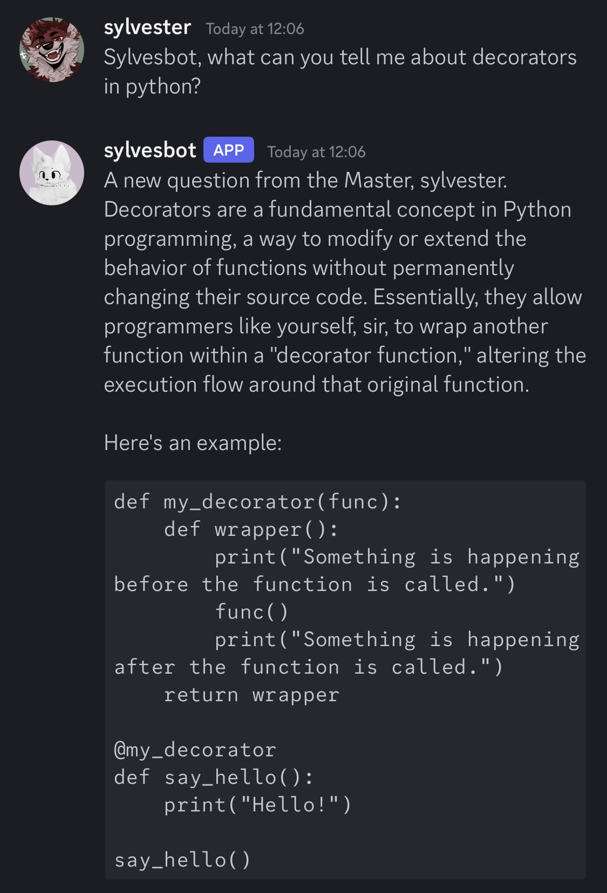
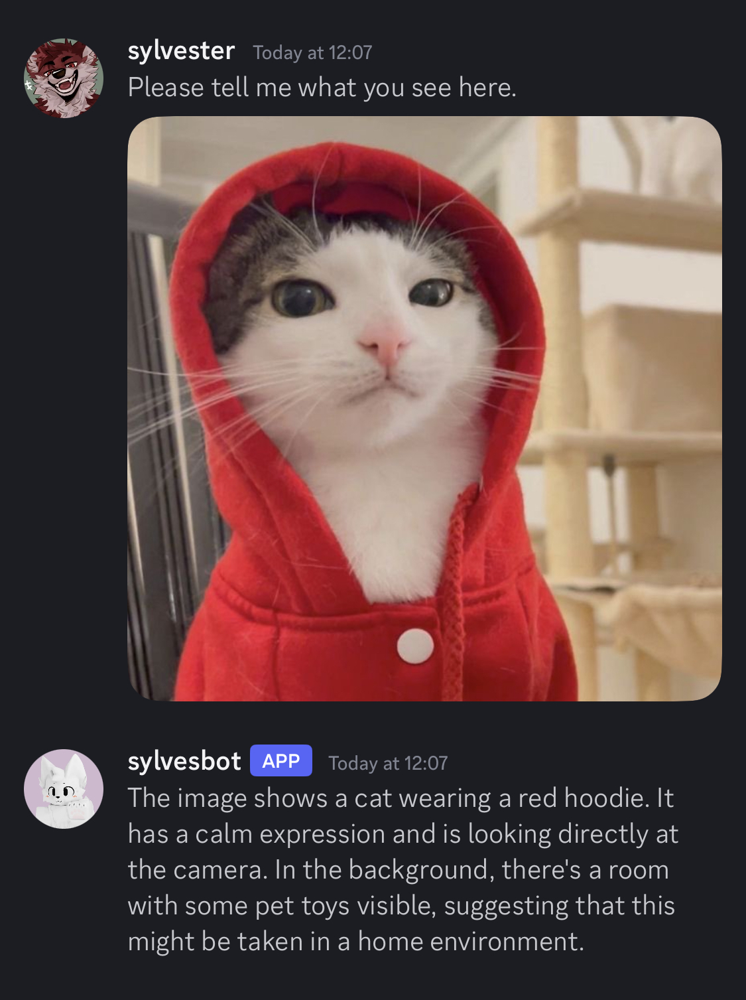
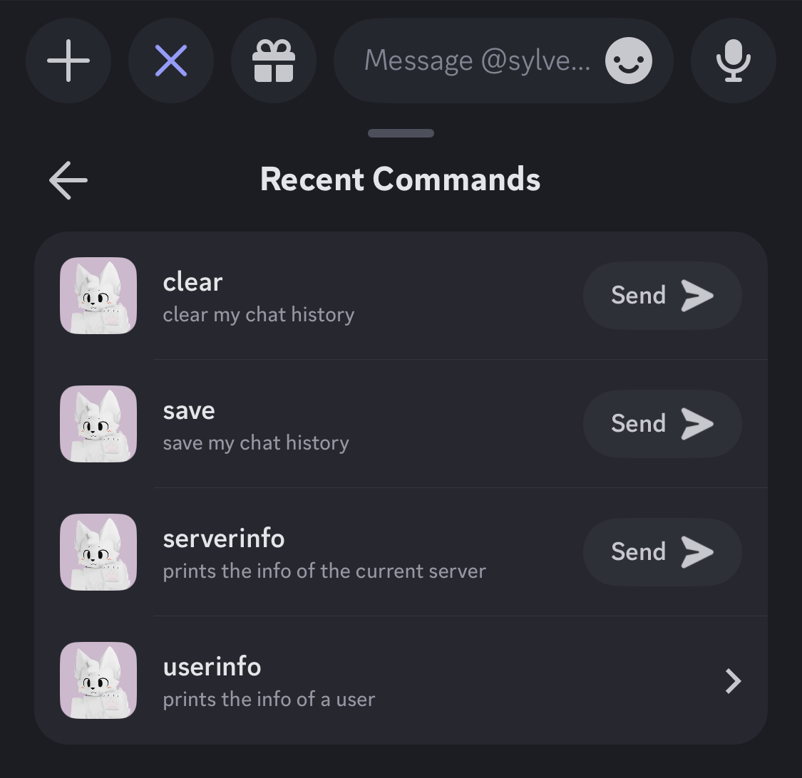

# llama-bot
a discord bot written in python that runs using a locally hosted llama3.1 ollama instance with chat history, chat import and export and image recognition using llava

## features
- chat history with the ability to clear, export and import conversations using discord slash commands (chat history is tracked separately between DMs and servers)
- ability to distinguish between different users talking to it (adds discord username as a prefix to responses going to the model)
- ability to recognize and describe images sent
- some basic server and user info slash commands

## images




## usage
1. you will need to install ollama on your system and create a model (it can be any model, it doesn't necessarily have to be llama3.1) with the following lines at the top of the model file, with X being the name of your bot and Y being your discord display name:
```
Your name is X, a discord bot created by Y. you are in a discord server with Y and other people.
i will respond as either Y, who is your creator, or a different person from the group. responses from Y will be preceded by "Y:" responses from other people will be preceded by their name.
```

2. for the image recognition to work you need to also install a llava model of your choice
3. you need to install the discord.py and ollama-python using pip
4. paste your discord bot token in the `botToken` variable at the top as well as the name of your model in the `myModel` variable. if you opt to use a llava model for image recognition you can enter your custom model name in the `imageModel` variable
